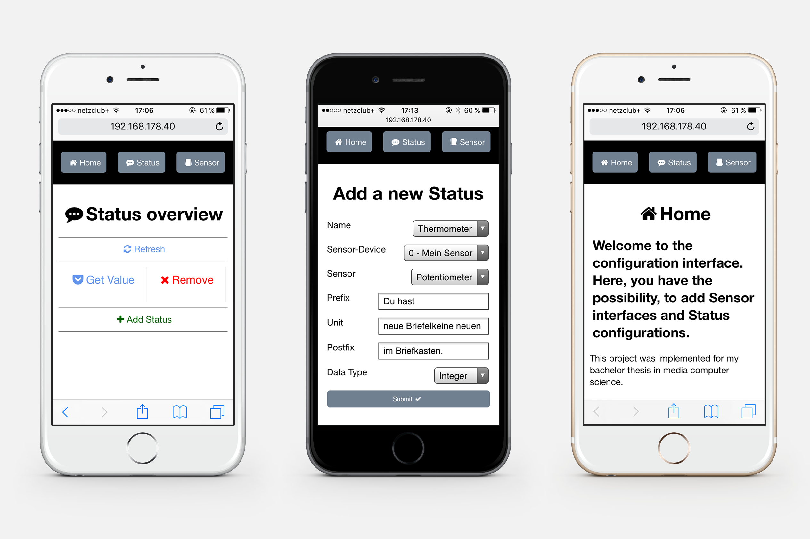

# README #

Implementierung einer Smart Home Umgebung (Bachelorarbeit von Jannis Jahr)

## Zusammenfassung ##
Ein Projekt im Rahmen meiner Bachelorarbeit. Das Programm dient der Abfrage von Stati in der Umgebung. Dazu kann ein Arduino am PC angeschlossen werden, der bestimmte Sensoren besitzen kann.
### Screenshot ###

## Setup ##
### Benötigte Hardware ###
Es wird ein Arduino mit angeschlossenen Sensoren benötigt. Darauf sollte der [Arduino Script](./arduino_script/arduino_script.ino) angepasst werden und installiert sein.
### Benötigte Software ###

Auf dem Rechner sollten [Python](https://www.python.org/) (Version 2.7x) und der Python Package Manager [pip](https://pypi.python.org/pypi/pip) installiert sein. Weiterhin sollte die Python Virtual Environment Umgebung [virtualenv](http://python-guide-pt-br.readthedocs.io/en/latest/dev/virtualenvs/) installiert werden.

### Einrichtung der virtuellen Umgebung virtualenv ###

Eine virtuelle Umgebung für Python installiert verwendete Pakete nicht global, sondern legt eine virtuelle Umgebung für diese an. Folgende Schritte legen diese virtuelle Umgebung an, aktivieren sie und installieren die Requirements. 

1. Virtuelle Umgebung mit Befehl ```virtualenv my_virtualenv``` anlegen
2. Aktivieren der virtuellen Umgebung mit Befehl ```. my_virtualenv/bin/activate```
3. Installieren der Requirements mit Befehl ```pip install -r requirements.txt```

Hier ist eine [vollständige Anleitung](http://python-guide-pt-br.readthedocs.io/en/latest/dev/virtualenvs/) zu finden. 

### Starten des Api-Servers ###

Mit dem Kommandozeilenbefehl ```python interfacelogic.py``` kann der Server gestartet werden. Es sollte eine ähnliche Meldung wie folgende erscheinen:
```
 * Running on http://0.0.0.0:5000/ (Press CTRL+C to quit)
```
### Beispielinterface ###

Ein Beispielinterface, in dem die einzelnen Konfigurationen geändert werden können, kann unter [localhost:5000](http://localhost:5000) abgerufen werden. Die Api für Alexa und das Mobilgerät sind unter dem Unterpfad /api und /ask zu finden.


### Credits ###

Jannis Jahr

Unter den [Requirements](./application/requirements.txt) sind die verwendeten Python-Pakete ersichtlich.

[Kontakt](mailto:jannis.jahr@hotmail.de)
